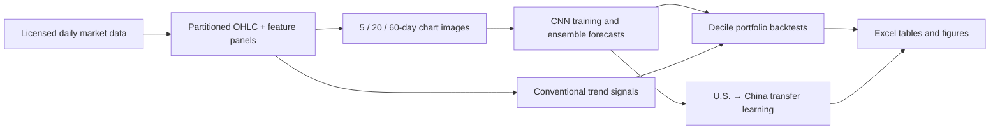
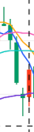
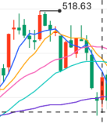
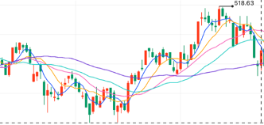

<p align="center">
  <a href="README.md">English</a> |
  <a href="README.zh-CN.md">简体中文</a>
</p>

# (Re-)Imag(in)ing Price Trends: Replication and Extension

<p align="center">
  <strong>Reproducing image-based return prediction and extending it from U.S. equities to China A-shares.</strong>
</p>

<p align="center">
  <a href="https://www.python.org/"></a>
  <a href="https://pytorch.org/"></a>
  <a href="LICENSE"></a>
</p>

## Overview

This repository is an independent replication and extension of Jiang, Kelly, and Xiu (2023), [“(Re-)Imag(in)ing Price Trends”](https://doi.org/10.1111/jofi.13268). It converts daily open-high-low-close (OHLC), volume, and moving-average histories into binary chart images, trains convolutional neural networks (CNNs) to estimate the probability of a positive future return, and evaluates those forecasts through portfolio sorts.

Beyond the U.S. replication, the project adds a China A-share implementation, cross-market transfer learning, conventional trend-signal benchmarks, holding-period decompositions, large-cap universe tests, and the 7,846-rule technical-analysis benchmark used in the paper.

> [!IMPORTANT]
> This is a research codebase, not the authors' official replication package. Raw CRSP and China market data are not redistributed because they may be subject to third-party licenses.

## Highlights

- **End-to-end research pipeline:** raw daily data → features → price-trend images → CNN forecasts → portfolio backtests.
- **Nine primary CNN specifications:** 5-, 20-, and 60-day image windows crossed with 5-, 20-, and 60-day return horizons.
- **Two equity markets:** U.S. stocks and China A-shares, with point-in-time universe filtering for the China sample.
- **Replication tests:** decile portfolios, equal/value weights, top-500 universes, multiple evaluation horizons, and holding-period decomposition.
- **Benchmark comparisons:** momentum, short-term reversal, weekly reversal, HZZ trend, distance to 52-week high, and 7,846 technical trading rules.
- **Transfer learning:** direct U.S.-to-China inference and head-only fine-tuning.
- **Reproducible artifacts:** checkpoints and large intermediates remain under a configurable external data root; tables and figures are written to `outputs/`.

## Research workflow



The notation **Ix/Ry** means that an `x`-trading-day image is used to predict the return over the next `y` trading days. For example, **I20/R5** uses a 20-day chart to forecast the next five-day return.

## Repository layout

| Path | Purpose |
| --- | --- |
| `src/` | Reusable data, image, model, backtest, analysis, and visualization modules |
| `scripts/py/` | Python entry points for the eight pipeline stages |
| `scripts/sh/` | Long-running `tmux` wrappers configured for the original research environment |
| `notebooks/` | Data inspection and image-preparation notebooks |
| `outputs/` | Generated backtest tables, figures, and analysis summaries |
| `docs/` | Local PDF and Markdown transcription of the reference paper |
| `logs/` | Example execution logs from completed runs |

## Requirements

- Python 3.10 or later
- Linux or macOS (the Python entry points are portable; shell wrappers use Bash and `tmux`)
- Sufficient disk space for partitioned panels, image memmaps, and model checkpoints
- A CUDA-capable GPU is strongly recommended for the full CNN grid; CPU execution is supported for small checks
- Authorized access to the required market data

Core Python dependencies are declared in `pyproject.toml`: NumPy, pandas, PyArrow, Matplotlib, OpenPyXL, and PyTorch.

## Quick start

### 1. Install

```bash
git clone https://github.com/George-hardworking/reimaging-price-trends-replication-and-extension.git
cd reimaging-price-trends-replication-and-extension

python -m venv .venv
source .venv/bin/activate
python -m pip install --upgrade pip
python -m pip install -e .
```

### 2. Choose an external data directory

Large and licensed files are intentionally kept outside the Git repository. Point the pipeline to a writable location:

```bash
export RPT_DATA_ROOT=/absolute/path/to/rpt-re-data
mkdir -p "$RPT_DATA_ROOT/raw/us"
```

If `RPT_DATA_ROOT` is not set, `src/config.py` uses the original machine-specific default. Setting the variable is therefore recommended for every new installation.

### 3. Add U.S. source data

Place the CRSP-style daily CSV at:

```text
$RPT_DATA_ROOT/raw/us/OHLC_92_24.csv
```

Required columns are:

```text
PERMNO, DlyCalDt, DlyCap, DlyRet, DlyVol,
DlyClose, DlyLow, DlyHigh, DlyOpen
```

Additional columns accepted by the current loader are `HdrCUSIP`, `Ticker`, `PERMCO`, and `DlyRetx`.

### 4. Run a reduced-scope U.S. walkthrough

The following commands restrict feature and image generation to 50 securities and train one model configuration. The default five seeds are retained so that an ensemble forecast is available to the backtest. This is intended to verify the workflow, not to reproduce the paper's estimates; CNN training can still take considerable time on a CPU.

```bash
python scripts/py/01_prepare_data.py all \
  --market us \
  --raw "$RPT_DATA_ROOT/raw/us/OHLC_92_24.csv" \
  --permno-limit 50 \
  --workers 2

python scripts/py/02_generate_images.py \
  --market us \
  --windows 5 \
  --permno-limit 50 \
  --workers 2

python scripts/py/03_train_cnn.py \
  --market us \
  --image-days 5 \
  --horizon 5 \
  --no-all-configs \
  --device cpu

python scripts/py/04_backtest.py \
  --market us \
  --image-days 5 \
  --horizon 5 \
  --eval-horizons 1
```

For a full GPU run across all nine model configurations and five ensemble seeds:

```bash
python scripts/py/02_generate_images.py --market us
python scripts/py/02_generate_images.py --market us --paper-cross
python scripts/py/03_train_cnn.py --market us --gpu-ids 0,1
python scripts/py/04_backtest.py --market us --all-configs --eval-horizons 1 2 3
```

Use each command's `--help` option to inspect all supported overrides and resume/rebuild controls.

## Data configuration

### U.S. sample

The default research window is 1993–2019. Models are trained and validated on 1993–2000 using a fixed 70/30 split, then evaluated out of sample from 2001 onward. The loader expects CRSP-style field names but accepts a user-supplied CSV path through `--raw`.

### China A-share sample

The default modeling window is 2007–2019, with training/validation through 2014 and out-of-sample evaluation beginning in 2015. The China loader expects:

- a daily stock panel containing security code, date, OHLC, volume, return, float capitalization, and total capitalization fields; and
- an `allstk`-style universe file used for point-in-time eligibility filtering.

Provide both files explicitly when preparing the China data:

```bash
python scripts/py/01_prepare_data.py all \
  --market cn \
  --dsf /absolute/path/to/dsf.parquet.gzip \
  --univ /absolute/path/to/allstk.parquet.gzip \
  --workers 8
```

Processed data are written below `$RPT_DATA_ROOT/processed/{us,cn}/`. Repository-level tables and figures are written below `outputs/`.

## Experiment entry points

| Stage | Entry point | Main output |
| --- | --- | --- |
| 01 | `scripts/py/01_prepare_data.py` | Partitioned OHLC and daily feature panels |
| 02 | `scripts/py/02_generate_images.py` | Yearly image memmaps and label files |
| 03 | `scripts/py/03_train_cnn.py` | CNN checkpoints and out-of-sample `p_up` forecasts |
| 04 | `scripts/py/04_backtest.py` | CNN decile-portfolio Excel workbooks |
| 05 | `scripts/py/05_benchmark_signals.py` | Trend benchmarks and Tables V–VIII inputs/results |
| 06 | `scripts/py/06_holding_breakdown.py` | Monthly return decomposition for days 1–5 and 6–20 |
| 07 | `scripts/py/07_transfer_us_to_cn.py` | Direct/fine-tuned U.S.-to-China transfer results |
| 08 | `scripts/py/08_stw_7846_rules.py` | 7,846-rule Sharpe distributions and Figure 8 |

Typical extension commands are:

```bash
python scripts/py/05_benchmark_signals.py all --market us
python scripts/py/06_holding_breakdown.py --market us
python scripts/py/07_transfer_us_to_cn.py all
python scripts/py/08_stw_7846_rules.py all --market us
```

The shell wrappers in `scripts/sh/` add timestamped logs and detached `tmux` execution, but they currently activate a locally named Conda environment (`5020_env`). Use the Python entry points directly unless you have adapted those wrappers to your environment.

## Result previews

### From a market chart to CNN input

The example below uses Kweichow Moutai (`600519`) with the formation date fixed at **2018-06-29**. Each market-chart window maps to the standardized binary OHLC, moving-average, and volume image received by the CNN.

<table>
  <thead>
    <tr>
      <th>Representation</th>
      <th>I5</th>
      <th>I20</th>
      <th>I60</th>
    </tr>
  </thead>
  <tbody>
    <tr>
      <td><strong>Market chart</strong></td>
      <td align="center"></td>
      <td align="center"></td>
      <td align="center"></td>
    </tr>
    <tr>
      <td><strong>CNN input</strong></td>
      <td align="center"></td>
      <td align="center"></td>
      <td align="center"></td>
    </tr>
  </tbody>
</table>

<p align="center"><em>Kweichow Moutai market windows and their corresponding I5, I20, and I60 CNN inputs.</em></p>

### U.S. baseline: paper versus replication

The table below compares the High-minus-Low (`H-L`) weekly portfolio from the published Table I with this repository's U.S. replication. `Ret` and `SR` retain the definitions and units used in the source tables; significance stars follow those tables.

| Weighting | Result | I5/R5 Ret | I5/R5 SR | I20/R5 Ret | I20/R5 SR | I60/R5 Ret | I60/R5 SR |
| --- | --- | ---: | ---: | ---: | ---: | ---: | ---: |
| Equal | Paper | 0.83*** | 7.15 | 0.84*** | 6.75 | 0.54*** | 4.89 |
| Equal | Replication | 0.71*** | 5.85 | 0.68*** | 5.89 | 0.41*** | 3.41 |
| Value | Paper | 0.23*** | 1.49 | 0.22*** | 1.74 | 0.16*** | 1.44 |
| Value | Replication | 0.22*** | 1.52 | 0.18*** | 1.50 | 0.15*** | 1.23 |

The replication preserves the main empirical pattern: realized returns rise across forecast deciles, and all three CNN specifications produce positive, statistically significant weekly H-L returns.

<details>
<summary>Full equal-weight U.S. decile results</summary>

#### I5/R5

| Portfolio | Paper Ret | Paper SR | Replication Ret | Replication SR |
| --- | ---: | ---: | ---: | ---: |
| Low | -0.28 | -1.92 | -0.24 | -1.72 |
| 2 | -0.04 | -0.27 | -0.04 | -0.24 |
| 3 | 0.03 | 0.15 | 0.02 | 0.09 |
| 4 | 0.08 | 0.41 | 0.06 | 0.31 |
| 5 | 0.09 | 0.48 | 0.09 | 0.49 |
| 6 | 0.14 | 0.70 | 0.12 | 0.61 |
| 7 | 0.17 | 0.84 | 0.16 | 0.79 |
| 8 | 0.22 | 1.06 | 0.22 | 1.06 |
| 9 | 0.30 | 1.48 | 0.29 | 1.41 |
| High | 0.54 | 2.89 | 0.47 | 2.42 |
| H-L | 0.83*** | 7.15 | 0.71*** | 5.85 |
| Turnover | 690% | — | 696% | — |

#### I20/R5

| Portfolio | Paper Ret | Paper SR | Replication Ret | Replication SR |
| --- | ---: | ---: | ---: | ---: |
| Low | -0.32 | -1.94 | -0.26 | -1.51 |
| 2 | -0.04 | -0.21 | -0.03 | -0.18 |
| 3 | 0.04 | 0.20 | 0.03 | 0.18 |
| 4 | 0.08 | 0.43 | 0.09 | 0.45 |
| 5 | 0.12 | 0.65 | 0.11 | 0.60 |
| 6 | 0.15 | 0.80 | 0.14 | 0.76 |
| 7 | 0.19 | 0.97 | 0.18 | 0.92 |
| 8 | 0.23 | 1.19 | 0.20 | 1.05 |
| 9 | 0.27 | 1.40 | 0.25 | 1.31 |
| High | 0.52 | 2.76 | 0.42 | 2.19 |
| H-L | 0.84*** | 6.75 | 0.68*** | 5.89 |
| Turnover | 667% | — | 674% | — |

#### I60/R5

| Portfolio | Paper Ret | Paper SR | Replication Ret | Replication SR |
| --- | ---: | ---: | ---: | ---: |
| Low | -0.21 | -1.10 | -0.13 | -0.60 |
| 2 | 0.02 | 0.12 | 0.02 | 0.12 |
| 3 | 0.07 | 0.35 | 0.07 | 0.35 |
| 4 | 0.11 | 0.58 | 0.10 | 0.54 |
| 5 | 0.14 | 0.75 | 0.12 | 0.64 |
| 6 | 0.16 | 0.88 | 0.14 | 0.78 |
| 7 | 0.17 | 0.93 | 0.16 | 0.86 |
| 8 | 0.20 | 1.08 | 0.17 | 0.95 |
| 9 | 0.22 | 1.23 | 0.20 | 1.11 |
| High | 0.33 | 1.85 | 0.29 | 1.58 |
| H-L | 0.54*** | 4.89 | 0.41*** | 3.41 |
| Turnover | 619% | — | 592% | — |

</details>

Source: [published Table I](docs/Re-Imagining-Price-Trends.md#table-i) and the replicated U.S. [weekly backtest workbook](outputs/04_backtest/cnn_baseline/us/weekly/all_h1.xlsx).

### China local training and U.S.-to-China transfer

The following tables compare three ways to produce China A-share signals:

- **China local:** train and test the CNN on the China sample.
- **U.S. direct:** apply the U.S.-trained CNN to China images without retraining.
- **U.S. fine-tuned:** start from U.S. weights and fine-tune the prediction head on the China training sample.

All entries report the **equal-weight H-L portfolio** over the 2015–2019 China out-of-sample period. Returns are annualized; `SR` is the annualized Sharpe ratio.

#### Weekly strategies (R5)

| Model source | I5/R5 Return | I5/R5 SR | I20/R5 Return | I20/R5 SR | I60/R5 Return | I60/R5 SR |
| --- | ---: | ---: | ---: | ---: | ---: | ---: |
| China local | 34.71% | 1.731 | 25.11% | 1.362 | 18.26% | 1.137 |
| U.S. direct | -6.82% | -0.340 | 8.39% | 0.383 | 4.57% | 0.231 |
| U.S. fine-tuned | 28.24% | 1.353 | 25.72% | 1.266 | 20.71% | 1.209 |

#### Monthly strategies (R20)

| Model source | I5/R20 Return | I5/R20 SR | I20/R20 Return | I20/R20 SR | I60/R20 Return | I60/R20 SR |
| --- | ---: | ---: | ---: | ---: | ---: | ---: |
| China local | 10.78% | 1.199 | 7.35% | 0.733 | 10.30% | 1.463 |
| U.S. direct | 10.01% | 0.911 | 12.95% | 1.153 | 3.77% | 0.395 |
| U.S. fine-tuned | 10.04% | 1.150 | 13.32% | 1.288 | 10.90% | 1.375 |

#### Quarterly strategies (R60)

| Model source | I5/R60 Return | I5/R60 SR | I20/R60 Return | I20/R60 SR | I60/R60 Return | I60/R60 SR |
| --- | ---: | ---: | ---: | ---: | ---: | ---: |
| China local | 6.86% | 0.901 | 4.07% | 0.537 | 1.94% | 0.286 |
| U.S. direct | 0.29% | 0.044 | 4.96% | 0.392 | 3.01% | 0.362 |
| U.S. fine-tuned | 9.14% | 1.092 | 2.94% | 0.362 | 3.79% | 0.563 |

The direct U.S.-to-China model remains informative in several monthly and quarterly configurations but is weak at the weekly horizon. Fine-tuning restores much of the short-horizon performance and produces the strongest I5/R60 result. Full equal-, float-cap-, and total-cap-weighted comparisons are available in the [weekly](outputs/07_transfer_us_cn/compare/cn/weekly/local_vs_direct_vs_finetune_h1.xlsx), [monthly](outputs/07_transfer_us_cn/compare/cn/monthly/local_vs_direct_vs_finetune_h1.xlsx), and [quarterly](outputs/07_transfer_us_cn/compare/cn/quarterly/local_vs_direct_vs_finetune_h1.xlsx) workbooks.

### Technical-rule benchmark

<p align="center">
  
</p>

<p align="center"><em>Technical-rule Sharpe distributions with CNN benchmarks.</em></p>

See `outputs/analysis_results/` for cumulative-return figures, additional decile curves, transfer-learning comparisons, and consolidated workbooks. Results in the repository are research artifacts and should not be interpreted as live or investable performance.

## Reproducibility notes

- The default ensemble contains five independently optimized CNNs per configuration.
- The train/validation split seed is fixed separately from model optimization seeds.
- Completed partitions and training jobs are checkpointed so interrupted runs can resume.
- `--fresh` rebuilds the artifacts targeted by a command; use it deliberately because full runs are computationally expensive.
- Exact replication still depends on source-database versions, universe construction, hardware, and numerical-library versions.

## Reference and citation

The reference article is included for research convenience as a [PDF](docs/%28Re-%29Imag%28in%29ing%20Price%20Trends.pdf) and a searchable [Markdown transcription](docs/Re-Imagining-Price-Trends.md).

If this repository contributes to academic work, please cite the original article and acknowledge this implementation:

```bibtex
@article{jiang2023reimagining,
  title   = {(Re-)Imag(in)ing Price Trends},
  author  = {Jiang, Jingwen and Kelly, Bryan and Xiu, Dacheng},
  journal = {The Journal of Finance},
  volume  = {78},
  number  = {6},
  pages   = {3193--3249},
  year    = {2023},
  doi     = {10.1111/jofi.13268}
}
```

## Contributing and support

Issues and pull requests are welcome. For a bug report, please include the pipeline stage, market, command, relevant log excerpt, and Python/PyTorch versions. Please do not upload licensed source data, credentials, or large model artifacts.

For questions, open a [GitHub issue](https://github.com/George-hardworking/reimaging-price-trends-replication-and-extension/issues).

## License

The code in this repository is released under the [MIT License](LICENSE). The reference article, source datasets, and any third-party materials retain their respective copyrights and license terms.

## Disclaimer

This repository is provided for academic research and education only. It does not constitute investment advice, and no result should be understood as a recommendation to trade any security.
