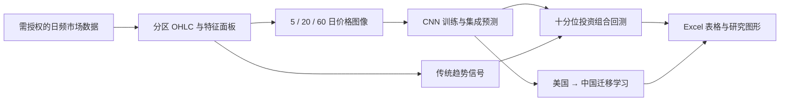

<p align="center">
  <a href="README.md">English</a> |
  <a href="README.zh-CN.md">简体中文</a>
</p>

# (Re-)Imag(in)ing Price Trends：复现与扩展

<p align="center">
  <strong>复现基于价格图像的收益预测方法，并将其从美国股票扩展到中国 A 股。</strong>
</p>

<p align="center">
  <a href="https://www.python.org/"></a>
  <a href="https://pytorch.org/"></a>
  <a href="LICENSE"></a>
</p>

## 项目简介

本仓库是对 Jiang、Kelly 与 Xiu（2023）论文 [《(Re-)Imag(in)ing Price Trends》](https://doi.org/10.1111/jofi.13268)的独立复现与扩展。项目将每日开盘价、最高价、最低价、收盘价（OHLC）、成交量和移动平均线编码为二值价格图像，训练卷积神经网络（CNN）预测未来收益为正的概率，并通过投资组合排序检验预测效果。

在美国股票复现之外，本项目进一步实现了中国 A 股样本、跨市场迁移学习、传统趋势信号基准、持有期收益拆解、大市值股票池检验，以及原论文使用的 7,846 条技术分析规则基准。

> [!IMPORTANT]
> 本项目是研究者的独立实现，并非原作者发布的官方复现包。CRSP 与中国市场原始数据可能受第三方授权限制，因此不随仓库分发。

## 核心内容

- **端到端研究流程：** 原始日频数据 → 特征 → 价格趋势图像 → CNN 预测 → 投资组合回测。
- **九种主要 CNN 设定：** 5、20、60 日图像窗口与 5、20、60 日预测期交叉组合。
- **两个股票市场：** 美国股票与中国 A 股；中国样本采用时点一致（point-in-time）的股票池过滤。
- **多维复现检验：** 十分位组合、等权/市值权重、前 500 大股票池、多评估期与持有期收益拆解。
- **传统信号对照：** 动量、短期反转、周度反转、HZZ 趋势、距 52 周最高价，以及 7,846 条技术交易规则。
- **迁移学习：** 美国模型直接迁移至中国市场，以及只微调预测头的迁移方案。
- **可复现产物：** 检查点和大型中间文件保存在可配置的外部数据目录中，最终表格与图片写入 `outputs/`。

## 研究流程



项目使用 **Ix/Ry** 表示“用过去 `x` 个交易日的图像预测未来 `y` 个交易日的收益”。例如，**I20/R5** 表示用 20 日价格图像预测未来 5 日收益。

## 仓库结构

| 路径 | 说明 |
| --- | --- |
| `src/` | 数据、图像、模型、回测、分析和可视化模块 |
| `scripts/py/` | 八个研究阶段的 Python 入口 |
| `scripts/sh/` | 针对原研究环境配置的 `tmux` 长任务封装脚本 |
| `notebooks/` | 数据检查与图像准备 Notebook |
| `outputs/` | 回测表格、研究图形与汇总结果 |
| `docs/` | 参考论文的本地 PDF 与 Markdown 转录版 |
| `logs/` | 已完成运行的示例日志 |

## 环境要求

- Python 3.10 或更高版本
- Linux 或 macOS（Python 入口具备可移植性；Shell 封装使用 Bash 和 `tmux`）
- 足够的磁盘空间，用于保存分区数据、图像 memmap 与模型检查点
- 完整 CNN 网格训练强烈建议使用支持 CUDA 的 GPU；小规模检查可以使用 CPU
- 对所需市场数据拥有合法授权

核心 Python 依赖已在 `pyproject.toml` 中声明，包括 NumPy、pandas、PyArrow、Matplotlib、OpenPyXL 与 PyTorch。

## 快速开始

### 1. 安装项目

```bash
git clone https://github.com/George-hardworking/reimaging-price-trends-replication-and-extension.git
cd reimaging-price-trends-replication-and-extension

python -m venv .venv
source .venv/bin/activate
python -m pip install --upgrade pip
python -m pip install -e .
```

### 2. 设置外部数据目录

大型文件与需授权数据不会放入 Git 仓库。请将研究流程指向一个可写目录：

```bash
export RPT_DATA_ROOT=/absolute/path/to/rpt-re-data
mkdir -p "$RPT_DATA_ROOT/raw/us"
```

若未设置 `RPT_DATA_ROOT`，`src/config.py` 会使用原开发机器上的默认路径。因此，新环境应始终显式设置该变量。

### 3. 准备美国股票源数据

将 CRSP 风格的日频 CSV 放置于：

```text
$RPT_DATA_ROOT/raw/us/OHLC_92_24.csv
```

必需字段为：

```text
PERMNO, DlyCalDt, DlyCap, DlyRet, DlyVol,
DlyClose, DlyLow, DlyHigh, DlyOpen
```

当前读取器还接受 `HdrCUSIP`、`Ticker`、`PERMCO` 与 `DlyRetx` 字段。

### 4. 运行缩小范围的美国样本流程

下列命令将特征和图像生成限制在 50 只股票，并只训练一种模型设定。默认的五个随机种子会予以保留，以生成回测所需的集成预测。该流程用于验证各阶段能否衔接，不用于复现论文的完整结果；即使缩小范围，使用 CPU 训练 CNN 仍可能耗时较长。

```bash
python scripts/py/01_prepare_data.py all \
  --market us \
  --raw "$RPT_DATA_ROOT/raw/us/OHLC_92_24.csv" \
  --permno-limit 50 \
  --workers 2

python scripts/py/02_generate_images.py \
  --market us \
  --windows 5 \
  --permno-limit 50 \
  --workers 2

python scripts/py/03_train_cnn.py \
  --market us \
  --image-days 5 \
  --horizon 5 \
  --no-all-configs \
  --device cpu

python scripts/py/04_backtest.py \
  --market us \
  --image-days 5 \
  --horizon 5 \
  --eval-horizons 1
```

使用 GPU 运行全部九种模型设定和五个集成随机种子：

```bash
python scripts/py/02_generate_images.py --market us
python scripts/py/02_generate_images.py --market us --paper-cross
python scripts/py/03_train_cnn.py --market us --gpu-ids 0,1
python scripts/py/04_backtest.py --market us --all-configs --eval-horizons 1 2 3
```

可在任意命令后添加 `--help`，查看全部路径覆盖、续跑和重建参数。

## 数据配置

### 美国股票样本

默认研究区间为 1993–2019 年。模型使用 1993–2000 年数据，按固定随机种子进行 70/30 的训练/验证划分；2001 年起为样本外评估期。读取器采用 CRSP 风格字段名，也可通过 `--raw` 指定自定义 CSV 路径。

### 中国 A 股样本

默认建模区间为 2007–2019 年，其中训练/验证期截至 2014 年，样本外评估始于 2015 年。中国数据读取器需要：

- 包含证券代码、日期、OHLC、成交量、收益率、流通市值与总市值的股票日频面板；
- 用于时点一致股票池过滤的 `allstk` 风格文件。

准备中国数据时请显式提供两个文件：

```bash
python scripts/py/01_prepare_data.py all \
  --market cn \
  --dsf /absolute/path/to/dsf.parquet.gzip \
  --univ /absolute/path/to/allstk.parquet.gzip \
  --workers 8
```

处理后的数据写入 `$RPT_DATA_ROOT/processed/{us,cn}/`，仓库内的最终表格与图片写入 `outputs/`。

## 实验入口

| 阶段 | 入口文件 | 主要输出 |
| --- | --- | --- |
| 01 | `scripts/py/01_prepare_data.py` | 分区 OHLC 与日频特征面板 |
| 02 | `scripts/py/02_generate_images.py` | 按年保存的图像 memmap 与标签文件 |
| 03 | `scripts/py/03_train_cnn.py` | CNN 检查点与样本外 `p_up` 预测 |
| 04 | `scripts/py/04_backtest.py` | CNN 十分位投资组合 Excel 工作簿 |
| 05 | `scripts/py/05_benchmark_signals.py` | 趋势基准及表 V–VIII 的输入与结果 |
| 06 | `scripts/py/06_holding_breakdown.py` | 月度收益在第 1–5 日与第 6–20 日的拆解 |
| 07 | `scripts/py/07_transfer_us_to_cn.py` | 美国模型直接迁移/微调至中国市场的结果 |
| 08 | `scripts/py/08_stw_7846_rules.py` | 7,846 条规则的夏普比分布与图 8 |

常用扩展实验命令如下：

```bash
python scripts/py/05_benchmark_signals.py all --market us
python scripts/py/06_holding_breakdown.py --market us
python scripts/py/07_transfer_us_to_cn.py all
python scripts/py/08_stw_7846_rules.py all --market us
```

`scripts/sh/` 中的 Shell 封装会提供带时间戳的日志和后台 `tmux` 运行，但它们目前会激活原开发环境中的 Conda 环境名 `5020_env`。除非已经按自己的环境修改这些脚本，否则建议直接使用 Python 入口。

## 结果预览

<p align="center">
  
  
  
</p>

<p align="center"><em>苹果公司在 2018-06-29 的 5 日、20 日和 60 日价格趋势图像示例。</em></p>

<p align="center">
  
</p>

<p align="center"><em>技术交易规则的夏普比分布及 CNN 基准。</em></p>

更多累计收益曲线、十分位组合曲线、迁移学习比较和汇总工作簿见 `outputs/analysis_results/`。仓库中的结果均为研究产物，不应被理解为实时或可直接投资的业绩。

## 可复现性说明

- 默认情况下，每种模型设定由五个独立优化的 CNN 构成集成预测。
- 训练/验证划分的随机种子与模型优化随机种子分开设置。
- 已完成的数据分区和训练任务会保存检查点，中断后可继续运行。
- `--fresh` 会重建当前命令对应的产物；完整实验计算成本较高，请谨慎使用。
- 精确复现仍会受到源数据库版本、股票池构造、硬件和数值计算库版本的影响。

## 参考文献与引用

仓库中提供参考论文的本地 [PDF](docs/%28Re-%29Imag%28in%29ing%20Price%20Trends.pdf) 与可检索的 [Markdown 转录版](docs/Re-Imagining-Price-Trends.md)，供研究时查阅。

若本仓库对你的学术研究有所帮助，请引用原论文，并在适当位置说明使用了本实现：

```bibtex
@article{jiang2023reimagining,
  title   = {(Re-)Imag(in)ing Price Trends},
  author  = {Jiang, Jingwen and Kelly, Bryan and Xiu, Dacheng},
  journal = {The Journal of Finance},
  volume  = {78},
  number  = {6},
  pages   = {3193--3249},
  year    = {2023},
  doi     = {10.1111/jofi.13268}
}
```

## 贡献与支持

欢迎提交 Issue 和 Pull Request。报告问题时，请附上实验阶段、市场、运行命令、相关日志片段以及 Python/PyTorch 版本。请勿上传需授权的源数据、账户凭证或大型模型文件。

如有问题，请创建 [GitHub Issue](https://github.com/George-hardworking/reimaging-price-trends-replication-and-extension/issues)。

## 开源许可

本仓库代码采用 [MIT License](LICENSE) 发布。参考论文、源数据和第三方材料仍分别适用其原有版权及许可条款。

## 免责声明

本仓库仅用于学术研究与教学，不构成任何投资建议，任何结果均不应被理解为对证券交易的推荐。
